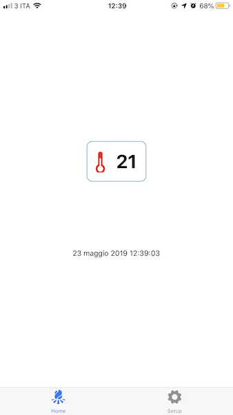
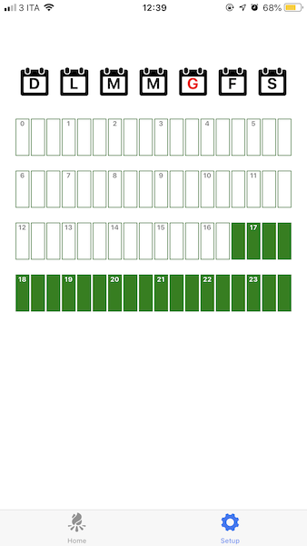

# Clima control station of AGOSTINI's house

The project is composed by 2 parts:
- a nodejs backend running on a Raspberry to switch on/off the heating system
- a ReactNative application to remotely control it


# Setup backend
```
yarn install
yarn start
```


# Setup mobile application 
```
cd ./src/ui
yarn install 
yarn start
```
The mobile application is Expo based and it has been published here https://expo.io/@parmesanking/agotherm


# Screenshots




# Credits
Luca Agostini (parmesanking_^_gmail.com)